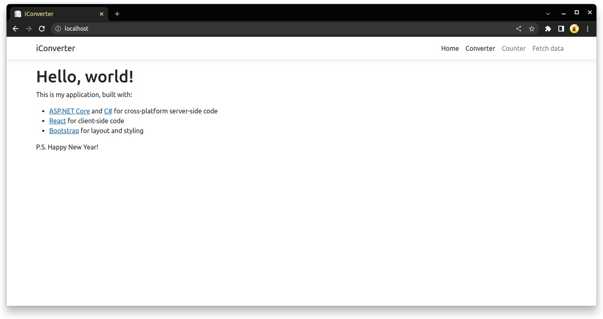
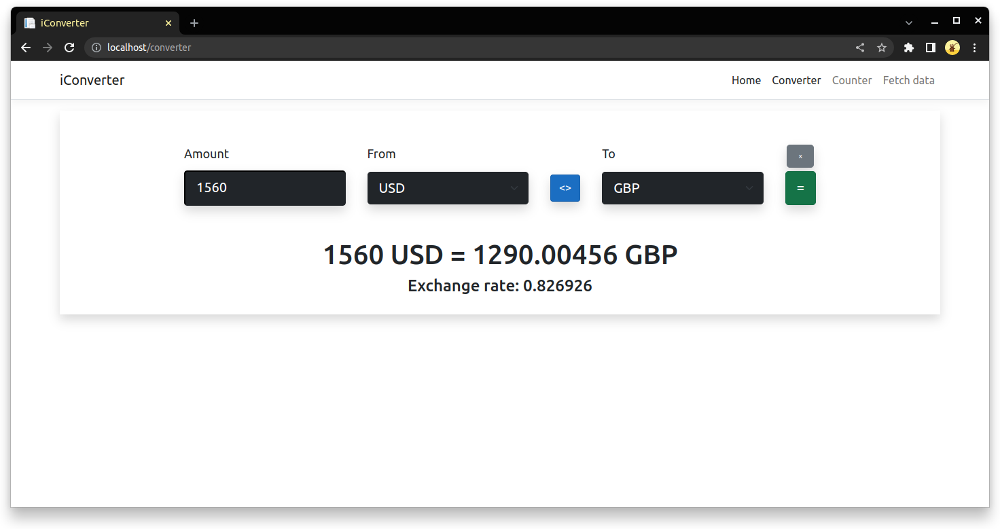
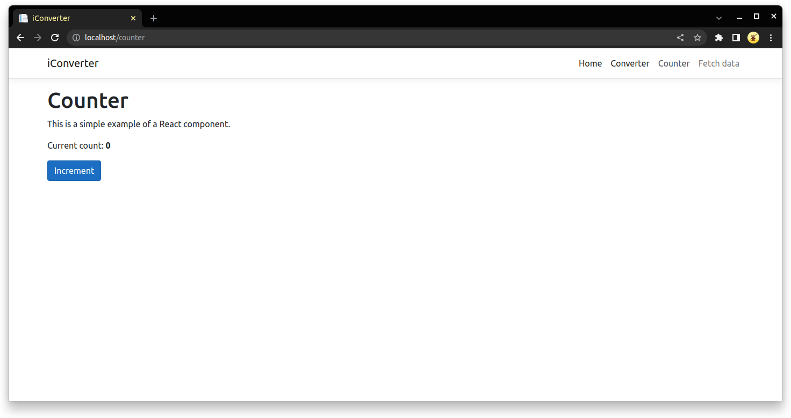
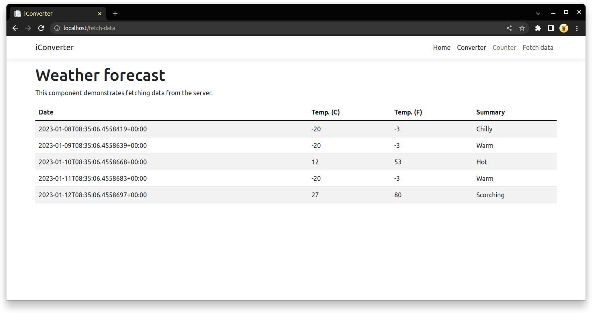

#### Взять для задания стандартный sample приложения на ASP.NET Core (.NET 6), и загрузить его в гитхаб  
Условия:
* Код приложения должен быть размещен на гитхаб  
* Можно использовать только сервисы AWS  
* Приложение должно быть упаковано в докер контейнер  
* Для хостинга приложения разрешено использовать только ECS  
* По пушу в master/main ветку репозитория должно быть организовано автоматическое юнит-тестирование и доставка приложения на dev  
* После ручной проверки, эта же версия приложения должна доставляться на prod  

***

Так как я пропустил три задания в Section 1, в том числе написание скрипта для конвертирования валют, я решил создать своё приложение, вместо использования стандартного сэмпла  
#### Приложение:  
- ASP.NET core 6.0 - backend
    - Web application
    - SPA proxy
    - Weather forecast controller
- React - frontend
    - Fetch data from weather forecast controller (стандартное демо в webapp .NET проекте)
    - Counter (стандартное демо в webapp .NET проекте)
    - Currency Converter - получает курс конвертации через freecurrencyapi

Приложение состоит из двух проектов (.NET with React и xUnit test) в одном sln-файле  

  
  
  
  

#### Юнит-тесты:  
- NPM: [App.test.js](./iConverter/ClientApp/src/App.test.js) - стандартный тест, проверяющий корректность отрисовки рендеров
- .NET: [iConverter_test.cs](./iConverter-test/iConverter_test.cs) - тест, проверяющий корректность данных, отдаваемых контроллером WeatherForecastController

#### Сборка docker-образа:  
[Dockerfile](./Dockerfile)  
Образ приложения собирается на базе образов 'mcr.microsoft.com/dotnet/sdk:6.0', 'mcr.microsoft.com/dotnet/aspnet:6.0', 'node:19-alpine3.16'. Multi-stage сборка позволяет получить готовый образ с приложением весом менее 90МБ  

#### AWS:  
